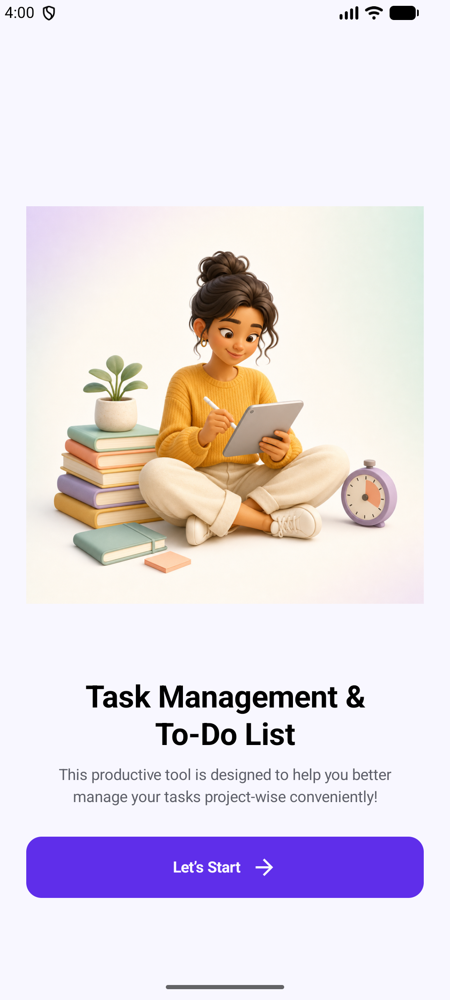
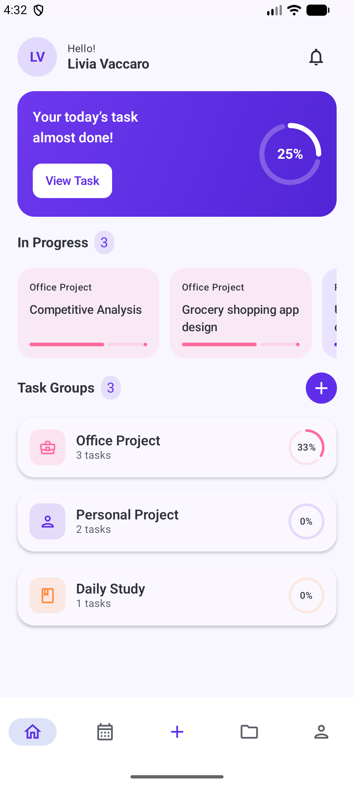
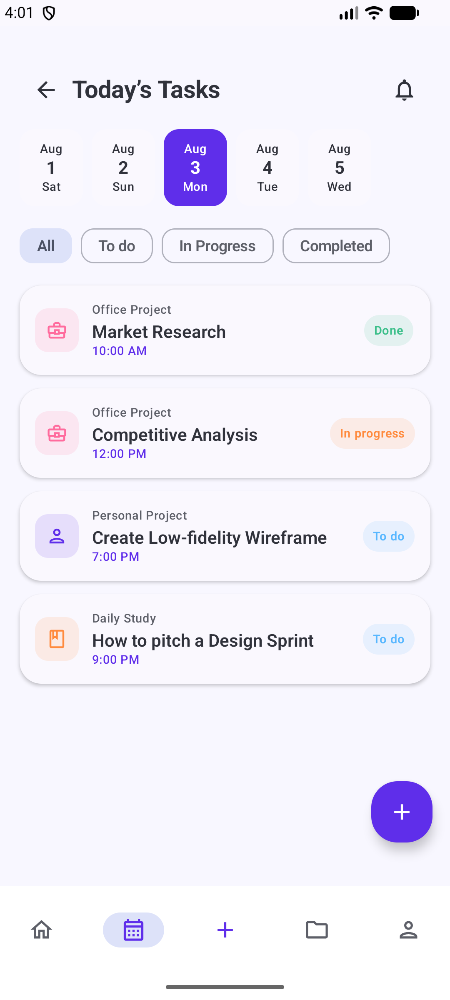

# Task Manager

A polished, offline-first Android task manager built with Kotlin, Jetpack Compose, Room,
and Material 3. The visual direction is inspired by the four-screen
[Task Management To-Do List App](https://www.figma.com/community/file/1143575071825582037/task-management-to-do-list-app)
community concept.

The app turns the visual concept into a complete product: onboarding, a live dashboard,
date-based task planning, project groups, task/project editors, filters, progress tracking,
and persistent settings all work end to end.

## Screens

| Onboarding | Dashboard | Today |
| --- | --- | --- |
|  |  |  |

## Features

- Create, edit, complete, reopen, filter, and delete tasks
- Set task project, date, time, duration, status, and priority
- Create project groups with descriptions, date ranges, and color themes
- Browse project details and add tasks directly to a project
- Live daily and per-project completion progress
- Optional due-time reminders with Android notification permission handling
- Persistent onboarding and notification preferences
- Android backup and device-transfer support for local app data
- Fully local storage; no account, server, or API key is required
- Seeded sample content on first launch so the dashboard is immediately useful

## Technical foundation

- Kotlin and Jetpack Compose with Material 3
- Navigation Compose
- Room database with a versioned migration and exported schemas
- DataStore preferences
- Hilt dependency injection
- StateFlow-based presentation state
- Minimum Android version: Android 8.0 (API 26)

The code is split into presentation, domain, data, and dependency-injection layers. Tasks,
projects, and preferences are exposed through repositories, so the UI stays independent of
storage details.

## Build and test

Open the project in a recent Android Studio version and run the `app` configuration, or use:

```bash
./gradlew assembleDebug
./gradlew testDebugUnitTest
./gradlew lintDebug
```

The installable APK is generated at `app/build/outputs/apk/debug/app-debug.apk`.

## Design credit

Visual direction is based on the linked Figma Community file, published under CC BY 4.0.
The onboarding artwork was created specifically for this implementation rather than copied
from the reference artwork.
