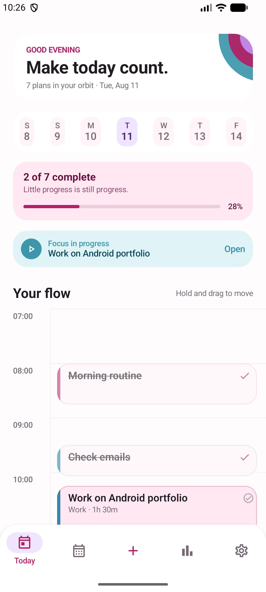
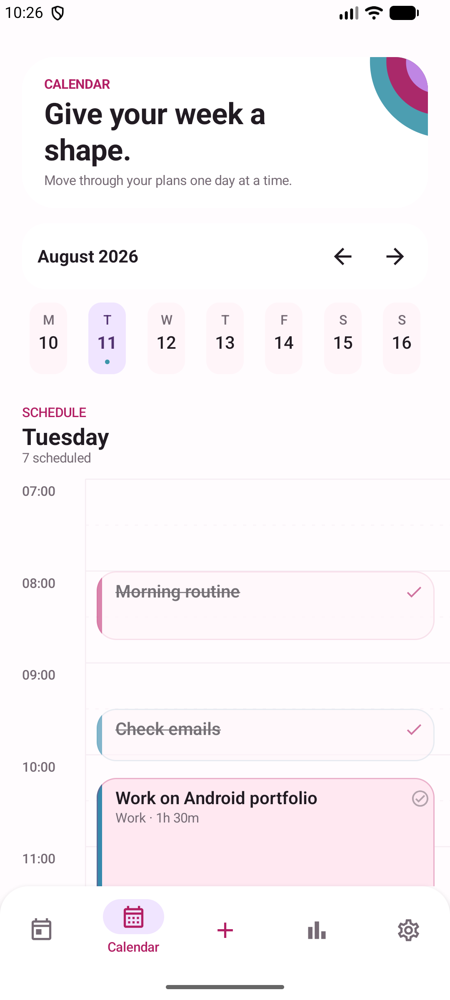
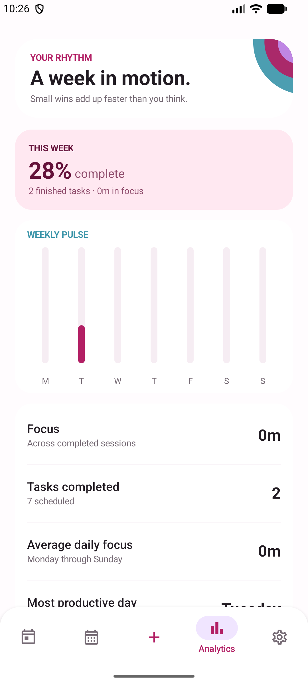
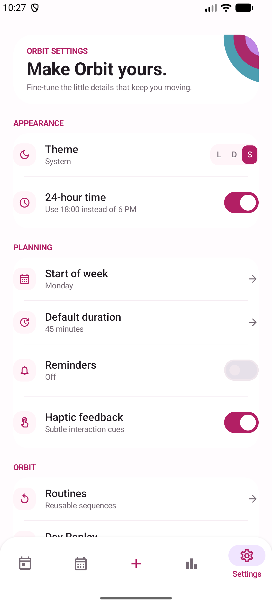
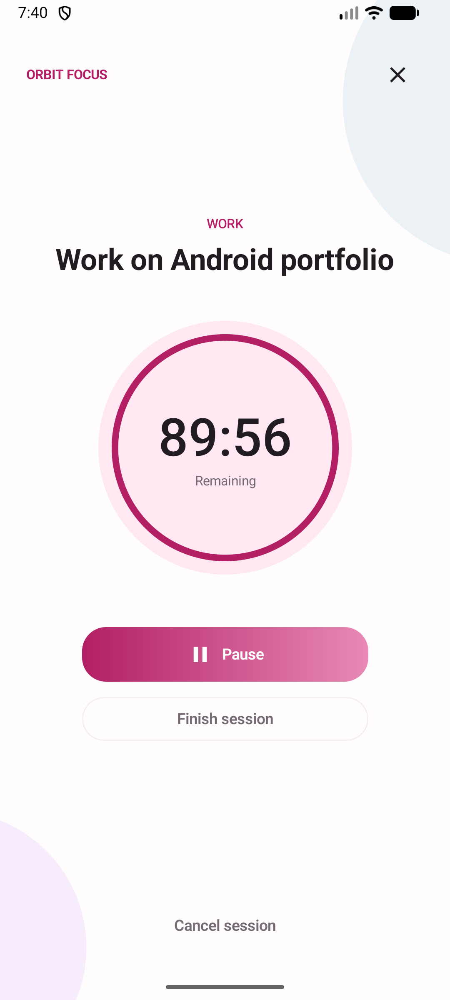

# Orbit

Orbit is a modern Android productivity app that transforms your daily schedule into an interactive timeline. Its visual language pairs bright white surfaces with berry-to-rose actions, aqua/lilac planning cues, and a small orbital arc motif that keeps every destination recognisably Orbit.

It is designed as an offline-first personal command center: plan a day visually, move work directly on the timeline, run focus sessions, reuse routines, understand weekly patterns, and replay what actually happened.

## Features

- Duration-aware day timeline with live-time marker and color-coded project cards
- Long-press drag rescheduling with 15-minute snapping, live time preview, animation, and haptics
- Task details, completion, priority, notes, subtasks, reminders, recurrence, and progressive task editing
- Offline natural-language task parsing for dates, weekdays, day periods, times, and durations
- Focus mode with a distraction-free orbital timer, pause, finish, cancel, progress, and persisted session history
- Week calendar with horizontal week navigation and timeline reuse
- Room-backed reusable routines with repeat days and reminder time
- Weekly completion and focus analytics rendered with a custom Compose chart
- Animated Day Replay with chronological work and focus events
- Light, dark, and system appearance; 24-hour time; week-start; duration; notification; and haptic preferences
- Local JSON export, WorkManager reminders, tablet split layout, and accessibility labels

## Screenshots



| Calendar | Analytics |
| --- | --- |
|  |  |
| Settings | Focus |
|  |  |

## Architecture

Orbit uses unidirectional state flow and a pragmatic clean architecture:

```text
Compose UI
    ↓ events                 ↑ immutable UI state
ViewModel + StateFlow
    ↓ use-oriented actions   ↑ repository flows
Repository interfaces
    ↓
Room / DataStore / WorkManager
```

Room is the source of truth for tasks, projects, focus sessions, routines, and day summaries. DataStore owns user preferences. UI state combines those streams in the Hilt-provided `TaskManagerViewModel`, and Compose collects it with lifecycle awareness.

Repository interfaces keep storage behind domain contracts, so a sync implementation can be added without changing feature UI.

## Tech stack

- Kotlin
- Jetpack Compose and Material 3
- Navigation Compose
- ViewModel, Coroutines, StateFlow, and Flow
- Room with exported schemas and explicit migrations
- DataStore Preferences
- Hilt
- WorkManager
- JUnit, coroutine test utilities, MockK, and Room testing

Minimum Android version: Android 8.0 (API 26).

## Project structure

```text
app/src/main/java/com/flowtask/app/
├── core/
│   ├── designsystem/theme/     # Orbit color, type, shape, and theme tokens
│   └── navigation/             # App shell and destination graph
├── data/
│   ├── local/                  # Room database, DAOs, entities, DataStore
│   ├── mapper/
│   ├── reminder/               # WorkManager notification scheduling
│   └── repository/             # Offline repository implementations
├── domain/
│   ├── model/
│   ├── parser/                 # Replaceable natural-language parser
│   ├── reminder/
│   └── repository/
├── feature/
│   ├── analytics/
│   ├── calendar/
│   ├── focus/
│   ├── replay/
│   ├── routines/
│   ├── settings/
│   ├── tasks/
│   ├── timeline/
│   └── today/
└── presentation/               # Shared state holder and task editor surface
```

The project currently ships as one Gradle app module while keeping feature boundaries explicit. That keeps build and navigation overhead proportionate to a portfolio-sized product without coupling the features.

## Animations

Motion is deliberately functional:

- task positions animate after schedule changes;
- completion and focus states crossfade;
- dragging lifts the task, snaps to quarter hours, and previews its new interval;
- quick add expands into a confirmation sheet;
- focus progress updates continuously;
- Day Replay reveals events progressively.

Most transitions stay within 150–350 ms. Borders and spacing establish depth before elevation.

## Offline-first architecture

Every primary workflow works without a network connection. Writes go to Room first and return through observed flows. Notifications are scheduled locally, command parsing is deterministic and local, and export uses Android's document picker. No API key or account is required.

## Testing and verification

Unit coverage targets the logic most likely to regress: natural-language parsing, timeline snapping, database conversion, repository consistency, reminder scheduling, UI-state derivation, and seeding behavior.

```bash
./gradlew testDebugUnitTest
./gradlew lintDebug
./gradlew assembleDebug
```

The debug APK is generated at `app/build/outputs/apk/debug/app-debug.apk`.

## Future improvements

- Optional encrypted cloud sync behind the existing repository contracts
- Richer conflict handling for overlapping timeline blocks
- Home-screen widgets and Wear OS focus controls
- Locale-aware natural-language parsing beyond English
- More instrumentation coverage for gesture and adaptive-layout behavior
